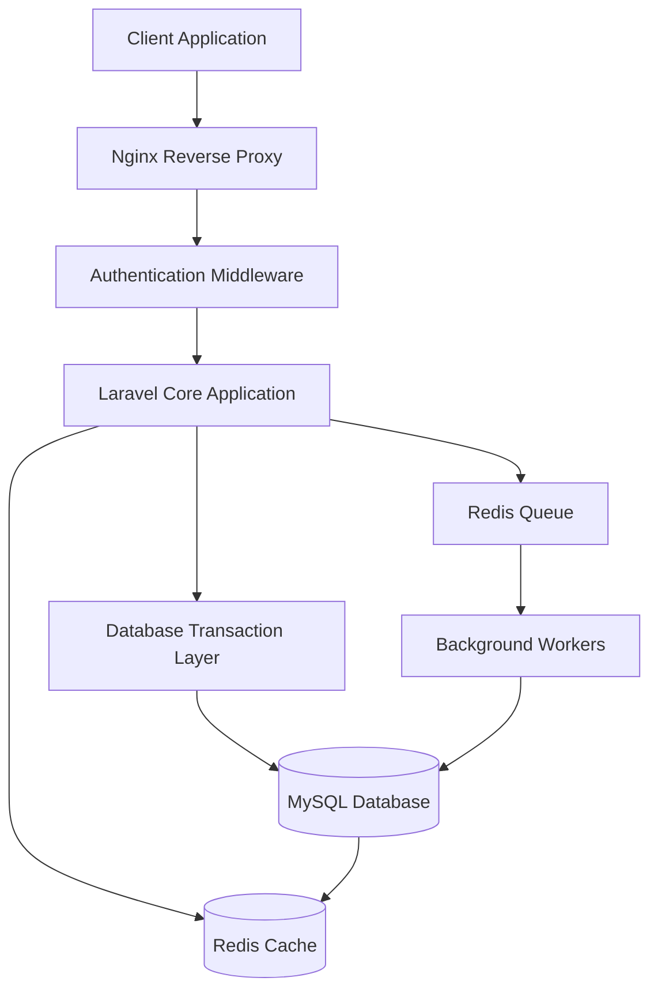

## 🎬 Weekmotion: System Architecture & Design Overview

This repository serves as the architectural documentation and system design blueprint for **Weekmotion**, a scalable video-sharing, content monetization, and creator ecosystem built using a decoupled monolithic architecture.

The system is optimized for maintainability and efficient handling of media-heavy workloads, leveraging asynchronous processing and strong database-level consistency.

---

## 🧠 Core System Architecture

The platform is organized into modular backend components, each responsible for a specific domain of the system.

### 1. Media & Content System
- **Chunked Video Ingestion:** Processes high-volume media file uploads in sequential chunks to prevent web server process blocking.
- **Polymorphic Community Feed:** Powers articles, user updates, and feed interactions using unified relational tables with polymorphic mapping for comments and reactions.
- **Role-Gated Content Middleware:** Enforces real-time access control on the activity feed, dynamically segregating content visibility between Free and Pro membership tiers.

### 2. Advertisement & Access Control System
- **Native Ad Campaign Engine:** Routes and serves configured Direct Link and Vignette ad zone streams based on client demand.
- **Asynchronous Analytics Tier:** Deflects high-frequency ad impression logs away from core tables to prevent write-locks under peak traffic.
- **Conditional Ad Filtering:** Stateful middleware checks user subscription status to completely bypass ad-injection loops for premium accounts.

### 3. Monetization & Incentive System
- **Creator Eligibility Router:** Validates eligibility metrics (strictly enforcing the 5 long videos and 50 subscribers criteria) via indexed relational queries before account onboarding.
- **Watch & Reward Pipeline:** Event-driven listeners capture user consumption milestones and dispatch credits to background queues away from the main HTTP thread.

### 4. Digital Commerce & Ledger System
- **Double-Entry Financial Ledger:** Manages user deposits, withdrawals, and internal balances inside atomic database transactions (`DB::transaction`) to guarantee consistency and eliminate race conditions.
- **Content Paywalls & Marketplace:** Processes single-unit purchase validation tokens to securely unlock premium posts and digital assets.

---

## 🆕 Weekmotion Extension Layer (Built on Existing Architecture)

The system has been extended with a new **Community Interaction + Content Structuring Layer**, enhancing usability, discovery, and engagement without modifying the core architecture.

---

## 💬 Community Interaction System (NEW)

- Users can now post comments on any content
- Fully threaded reply system (comment → reply → nested reply support)
- Real-time discussion structure for engagement
- Admin moderation support (delete comments & replies)

This system integrates with the existing **polymorphic feed architecture** to ensure scalable interaction handling across all content types.

---

## 🏷️ Dynamic Category Management System (NEW)

- Admin can create, update, and manage content categories dynamically
- Each post can be assigned a category during creation
- Default category fallback system implemented when no category is selected
- Categories are integrated into feed filtering layer

This extends the existing **polymorphic content feed system** without changing database core structure.

---

## 🔍 Smart Feed Enhancement Layer (NEW UI LOGIC)

A new intelligent feed layer has been added on top of the existing feed engine:

### Features:
- Global search bar for content discovery
- Filter system:
  - All Content
  - Category-based filtering
  - Course content
  - Premium content
  - Tools & Resources
- Unlocked Content quick-access panel for users

This layer operates as a **frontend orchestration layer** over existing backend feed APIs.

---

## 🔓 User Unlock Library Extension (ENHANCED)

- Users maintain a persistent **Unlocked Content Library**
- Subscription-based temporary access control remains unchanged
- Unlocked content is restored automatically upon subscription renewal
- Library works as a **user-level access cache layer**

This integrates with existing **content paywall & marketplace system**.

---

## 🛠 Admin Control Panel Extension

New administrative capabilities added:

- Category management dashboard
- Advanced comment moderation system:
  - View all comments (latest first)
  - Threaded reply visualization
  - Delete comment/reply functionality
- Content visibility monitoring for feed system

This extends the existing **role-based middleware system**.

---

## ⚙️ System Impact Summary

These updates introduce a new **interaction and discovery layer** while preserving:

- Existing media ingestion pipeline
- Monetization and ledger system
- Role-gated content middleware
- Asynchronous processing architecture

No core database disruption has been introduced — only **layered feature expansion**.

---

## 🏗️ System Data Flow

This diagram represents the high-level request lifecycle, asynchronous processing flow, and storage segmentation layers.

