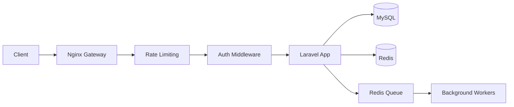
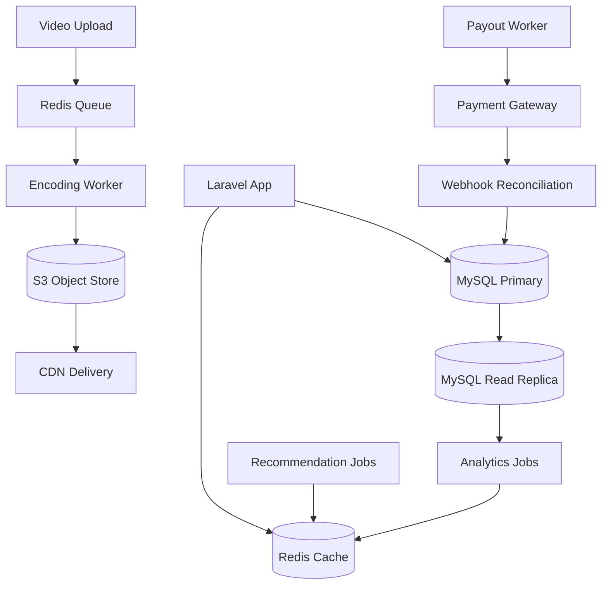

## 🎬 Weekmotion: System Architecture & Design Overview

This repository serves as the architectural documentation and system design blueprint for **Weekmotion**, a scalable video-sharing, content monetization, and creator ecosystem built using a decoupled monolithic architecture.

The system is optimized for maintainability and efficient handling of media-heavy workloads, leveraging asynchronous processing and strong database-level consistency.

<div align="left">

---

[](#)
[](#)
[](#)
[](#)
[](#)
[](#)

</div>

---

## Overview

This repository is the architectural documentation and system design blueprint for **Weekmotion** — a scalable video-sharing, content monetization, and creator ecosystem built on a **decoupled monolithic architecture**.

The system is built for maintainability and efficient handling of media-heavy workloads, using asynchronous processing and strong database-level consistency as its two core design pillars.

---

## 📊 Platform Snapshot

| Attribute | Detail |
|---|---|
| **Founded** | 2021 |
| **Active Users** | 20,000+ |
| **Creator Ecosystem** | ✅ |
| **Video Sharing Platform** | ✅ |
| **Community Feed System** | ✅ |
| **Digital Marketplace** | ✅ |
| **Professional Services Platform** | ✅ |

---

## 🗺️ System at a Glance

The simplest possible view of the platform — one request, start to finish:

```
Client → Nginx (Gateway + Rate Limit) → Laravel App (Auth + Logic)
                                              ↓              ↓           ↓
                                           MySQL          Redis       Redis Queue
                                                                          ↓
                                                                   Background Workers
                                                                   (encoding, payouts,
                                                                    notifications, reco)
```

> **Engagement signals** (likes, watches, follows) are written once by the Social & Engagement System and consumed across Feed ranking, Search personalization, and Recommendation scoring — no data is duplicated between systems.

---

## 🧠 Core Systems

Eight domain systems, each owning a clear slice of responsibility. Where systems share data (e.g. engagement signals feeding recommendations), the consuming system references the producing system rather than duplicating the concept.

---

### 1 · Media & Storage System

*Full lifecycle of video content — upload through encoding, delivery, and persistence.*

| Component | Description |
|---|---|
| **Chunked Video Ingestion** | High-volume uploads processed in sequential chunks, preventing web server blocking during large file transfers. |
| **Async Encoding Pipeline** | Raw video queued for format normalization and playback transcoding — fully decoupled from the HTTP cycle. |
| **Adaptive Streaming** | Processed video served as segmented files (HLS/MP4) stored by content ID, enabling range-request streaming without full-file delivery. |
| **CDN Asset Delivery** | Thumbnails, video segments, and digital assets served exclusively via CDN, removing origin load from high-traffic pages. |
| **Object Storage** | All binary media persisted to an S3-compatible object store — decoupled from the relational database and application filesystem. |
| **Relational Store (MySQL)** | All structured data — users, content metadata, transactions, social graph, notifications — persisted in MySQL with schemas indexed per query pattern. |
| **Cache Layer (Redis)** | Feed aggregates, engagement counters, session tokens, recommendation results, and watch-position state stored in Redis with TTL policies per data type. |
| **Role-Gated Content Middleware** | Real-time access control dynamically segregates content visibility between Free and Pro membership tiers. |

---

### 2 · Feed, Search & Discovery System

*Community feed, content filtering, full-text search, and recommendation — unified because all three consume the same engagement signals produced by the Social & Engagement System.*

| Component | Description |
|---|---|
| **Polymorphic Community Feed** | Articles, videos, and user updates powered by unified relational tables with polymorphic mapping for comments and reactions across all content types. |
| **Feed Filter System** | Frontend filter layer (All Content, Category, Course, Premium, Tools & Resources) operates as an orchestration layer over backend APIs without touching core feed logic. |
| **Full-Text Search** | Content records indexed via MySQL full-text indexes at current scale, schema designed for forward migration to a dedicated search engine as index volume grows. |
| **Search Ranking** | Results ranked by composite score: text relevance, recency, engagement signals (views + likes), and follow-graph proximity for authenticated users. |
| **Trending Keyword Boost** | Search query frequency aggregated over rolling time windows; queries exceeding a threshold boost associated content in discovery results. |
| **Recommendation System** | New users served trending and category-curated content (cold start). Once engagement history accumulates, a weighted interest profile (category affinity scores, updated via background jobs) drives personalized ranking across feed, related panels, and discovery surfaces. |
| **Trending Content Ranker** | Time-decayed engagement score computed per content item (recent views + likes + comments with exponential decay), surfacing genuinely trending over historically popular but stale content. |
| **Search & Recommendation Cache** | Frequently repeated queries and pre-computed recommendation sets stored in Redis — results served without per-request database overhead. |

---

### 3 · Monetization & Creator Economy System

*Creator eligibility, reward distribution, financial ledger, marketplace, and full payout lifecycle — one financial domain.*

| Component | Description |
|---|---|
| **Creator Eligibility Router** | Validates eligibility criteria (5 long videos and 50 subscribers) via indexed relational queries before monetization onboarding. |
| **Watch & Reward Pipeline** | Event-driven listeners capture consumption milestones and dispatch reward credits to background queues, away from the HTTP thread. |
| **Double-Entry Financial Ledger** | Deposits, withdrawals, and balances managed inside atomic `DB::transaction` blocks — consistency guaranteed, race conditions eliminated. |
| **Content Paywalls & Marketplace** | Single-unit purchase validation tokens securely unlock premium posts and digital assets. |
| **Revenue Sharing Model** | Creator earnings computed as a configurable platform-split at payout calculation time, not at transaction time — enabling rate changes without data migration. |
| **Creator Earnings Wallet** | Each creator maintains a ledger sub-account. Credits from rewards, sales, and subscription shares posted as atomic entries with full audit trail. |
| **Subscription Revenue Distribution** | On payment cycle settlement, a background job allocates the creator's share via a `DB::transaction`-wrapped double-entry post — no revenue created or lost. |
| **Withdrawal Processing** | Withdrawal requests enqueued as background jobs, validated against threshold and balance, then routed to the payment gateway — decoupled from HTTP to prevent timeout failures. |
| **Payment Gateway Integration** | Outbound payouts dispatched through a gateway abstraction interface. Gateway responses (success, pending, failed) reconciled back into the ledger via webhook listeners. |

---

### 4 · Social & Engagement System

*Follow relationships, likes, bookmarks, and watch history — unified because all produce the signals consumed by Feed & Discovery.*

| Component | Description |
|---|---|
| **Follow Relationship System** | Directed follow associations stored in an indexed relational graph table, supporting O(1) follow-state lookups and paginated follower/following retrieval. |
| **Subscriber Binding** | Paid subscription state bound to creator–user relationships, gating subscriber-only content and satisfying creator monetization threshold checks. |
| **Follow-Driven Feed Ranking** | Follow relationships propagate into feed ranking, surfacing content from followed creators at elevated priority. |
| **Social Metric Counters** | Follower and subscriber counts maintained as denormalized counters updated via background jobs, avoiding write contention during high-volume follow events. |
| **Like System** | Like events persisted via a polymorphic interactions table — unified handling across videos, posts, and articles without schema duplication. |
| **Bookmark System** | Bookmarks stored as user-scoped polymorphic records, accessible through a dedicated saved content panel. |
| **Engagement Signal Pipeline** | Like, bookmark, and watch events dispatched as background jobs — decoupled from the HTTP cycle, feeding the recommendation interest profile. |
| **Watch Event Recorder** | Video play events captured asynchronously as timestamped records powering watch history, continue watching, and the recommendation interest profile. |
| **Continue Watching State** | Last watched position per user per video updated on pause or exit, enabling seamless cross-device resume. |

---

### 5 · Notification System

*Event-driven dispatch, fully decoupled from application logic via the queue infrastructure.*

| Component | Description |
|---|---|
| **In-App Notification Dispatcher** | Platform events (new follower, comment, content unlock, reward credit) write notification records to a dedicated table, scoped per user with read-state tracking. |
| **Push Notification System** | Background worker reads from the push queue and batches device token dispatches to a third-party push provider — decoupled from the HTTP cycle. |
| **Creator Alert System** | Creators receive targeted alerts for subscriber milestones, new purchases, and eligibility changes via the same pipeline with creator-scoped filters. |
| **Notification Read-State** | Read/unread state tracked via indexed boolean flags with batch mark-as-read support to minimize update queries at scale. |

---

### 6 · Advertisement System

*Ad delivery, impression logging, and subscription-based bypass.*

| Component | Description |
|---|---|
| **Native Ad Campaign Engine** | Routes and serves Direct Link and Vignette ad zone streams based on client demand configuration. |
| **Async Impression Logging** | High-frequency impression events deflected to background queues, preventing write-locks on core tables under peak traffic. |
| **Subscription-Based Ad Bypass** | Middleware checks user subscription status and completely bypasses ad-injection loops for premium accounts. |

---

### 7 · Security System

*Practical security controls for a Laravel-based monolith at this scale — scoped to what is implemented.*

| Component | Description |
|---|---|
| **Rate Limiting** | Request rates enforced per-IP and per-user at Nginx and application middleware layers, with endpoint-class thresholds and temporary block on sustained violation. |
| **Spam Detection** | Repetitive submissions evaluated against frequency thresholds. Accounts exceeding signals are flagged for moderation review and rate-limited at the submission layer. |
| **Login Anomaly Detection** | Auth events logged with IP, device fingerprint, and timestamp. Logins from unrecognized devices trigger account notifications and may require re-authentication. |
| **Two-Factor Authentication (2FA)** | Creator and admin accounts support TOTP-based 2FA at session establishment. |
| **Session Management** | Sessions tracked per user with device identifiers. Users can revoke sessions from account settings; server-side invalidation enforced via Redis. |
| **Abuse Reporting System** | User-submitted reports enter the moderation queue with structured metadata. Repeat-reported content and repeat-offending accounts surfaced at elevated priority in the admin dashboard. |

---

### 8 · Platform Operations System

*API surface, observability, and admin tooling — the systems that keep the platform operable.*

| Component | Description |
|---|---|
| **REST API (v1)** | Resource-oriented REST API over core domain entities. Current stable surface is `v1`; `v2` reserved for future mobile and third-party integrations. |
| **API Gateway (Nginx)** | Nginx routes requests to Laravel with connection pooling and request buffering. Endpoint routing follows resource controller pattern with explicit HTTP verb mapping. |
| **Authentication System** | Laravel Sanctum: session-based auth for the web client, bearer token auth for API consumers, middleware-level validation on all authenticated endpoints. |
| **Request Validation** | Form Request validators enforce schema constraints and business rule pre-conditions before reaching service logic. |
| **Logging System** | Application events and errors written to structured log files with severity levels, organized by service context with configurable rotation. |
| **Error Tracking** | Exceptions captured and aggregated with grouped reports, stack traces, and affected user counts. Frequency alerts on high-volume errors. |
| **Queue Monitoring** | Queue depth, worker throughput, job failure rates, and retry counts monitored. Backlog alerts fire before issues reach user-facing latency. |
| **Slow Query Detection** | MySQL slow query logging captures threshold-exceeding queries for index optimization review, catching N+1 regressions before production. |
| **Uptime Monitoring** | Critical endpoints (feed, auth, upload, payment) monitored externally with alerting on availability degradation. |
| **Creator Studio** | Creators manage content, pricing, category assignments, and payout history from a unified interface. Analytics served from pre-aggregated background records, isolated from live write traffic. |

---

## 🆕 Extension Layer

> Built on top of the existing architecture without modifying core systems or database structure.

---

### 💬 Community Interaction System `NEW`

*Integrates with the existing polymorphic feed architecture.*

- Users can post comments on any content type
- Fully threaded reply system (comment → reply → nested reply)
- Real-time discussion structure for engagement
- Admin moderation support (delete comments & replies)

---

### 🏷️ Dynamic Category System `NEW`

*Extends the polymorphic content feed system without changing database core structure.*

- Admin can create, update, and manage content categories dynamically
- Each post can be assigned a category during creation
- Default category fallback when no category is selected
- Categories integrated into the feed filter layer

---

### 🔍 Smart Feed UI Layer `NEW`

*A frontend orchestration layer over existing backend feed APIs.*

- Global search bar for content discovery
- Filter system: All Content · Category · Course · Premium · Tools & Resources
- Unlocked Content quick-access panel for users

**Feed Portal:** [`weekmotion.com/feed`](https://weekmotion.com/feed)

---

### 🔓 User Unlock Library `ENHANCED`

*Integrates with the existing content paywall and marketplace system.*

- Users maintain a persistent Unlocked Content Library
- Subscription-based temporary access control remains unchanged
- Unlocked content restored automatically upon subscription renewal
- Library functions as a user-level access cache layer

---

### 📜 Content Governance System `NEW`

| Capability | Description |
|---|---|
| Copyright & Content Policy Center | Centralized policy reference for platform rules |
| Content Report Center | Community-driven content submission workflow |
| UGC Disclosure Notices | Transparency notices for user-generated content |
| Copyright Complaint Workflow | Structured review pipeline for copyright claims |
| Moderation Tools | Admin-level content management suite |
| Premium Preview Protection | Access-controlled preview layer for paid content |

**Compliance:** Users can report policy violations, copyright owners can submit infringement complaints, and reported content may be reviewed, restricted, or removed. Repeat violations may result in account restrictions.

---

### 🛠 Admin Control Panel `EXTENDED`

*Extends the existing role-based middleware system.*

- Category management dashboard
- Comment moderation: view all (latest first), threaded reply visualization, delete functionality
- Content visibility monitoring for feed system

---

## ⚙️ System Impact Summary

| Preserved System | Status |
|---|---|
| Media ingestion pipeline | ✅ Intact |
| Monetization and ledger system | ✅ Intact |
| Role-gated content middleware | ✅ Intact |
| Asynchronous processing architecture | ✅ Intact |

> No core database disruption — only layered feature expansion.

---

## 🌐 Digital Services Platform

Beyond the creator ecosystem, Weekmotion operates a dedicated services platform for businesses and entrepreneurs.

### Service Capabilities

| | |
|---|---|
| Custom Website Development | Domain & Hosting Services |
| E-Commerce Solutions | WhatsApp Marketing |
| SEO Optimization | Bulk SMS Solutions |
| Digital Advertising & Growth Services | |

- Conversion-focused landing page with mobile-first responsive design
- SEO-optimized content architecture for better discoverability
- Improved lead generation workflow and service presentation

**Service Portal:** [`weekmotion.com/service`](https://weekmotion.com/service)

> The service platform expands Weekmotion into a complete digital ecosystem — content, community, and professional services under one roof.

---

## ⚠️ System Constraints & Known Bottlenecks

Real systems have limits. These are the known constraints of the current architecture and how they are managed.

| Constraint | Risk | Mitigation |
|---|---|---|
| **Max Upload Size** | Very large files may exhaust worker memory or hit server timeout limits before chunking completes. | Chunked upload with configurable chunk size limits. File size validation enforced before ingestion begins. |
| **Queue Backlog Risk** | A spike in engagement events (viral content) can flood the queue faster than workers process it, delaying notifications and reward credits. | Queue depth monitoring with backlog alerts. Worker count scales horizontally. Non-critical job classes (analytics) separated from critical ones (payouts, notifications). |
| **MySQL Scaling Ceiling** | The relational database is the hardest constraint. At high write volume, a single MySQL primary becomes a bottleneck for concurrent engagement writes and media metadata. | Async writes via queue jobs reduce direct MySQL write pressure. Read replica routing planned for analytics. Cache layer absorbs the majority of read load. |
| **Redis Memory Pressure** | If feed aggregates, recommendation caches, and session data grow unbounded, Redis memory pressure leads to cache evictions that degrade performance. | TTL policies enforced per key type. Cache key namespacing isolates critical from non-critical data. Memory monitoring with alert thresholds. |
| **CDN Dependency Risk** | If the CDN provider has an outage, all media delivery (video, thumbnails, assets) is affected — the application itself stays up but content is inaccessible. | Object storage serves as the fallback origin. CDN provider redundancy is a Stage 2 engineering consideration. |
| **Monolith Scaling Ceiling** | The entire application scales horizontally as one unit. A single high-load system (e.g. encoding jobs) cannot be independently scaled without scaling the full application process. | High-load async work (encoding, payouts) runs in isolated worker processes, not the web process. This provides partial isolation without full service decomposition. |
| **Eventual Consistency Windows** | Engagement counts (likes, views) and recommendation scores are updated asynchronously — brief windows exist where displayed counts lag behind actual state. | Short TTL cache refresh cycles minimize the window. Database remains the authoritative source for financial data (immediate consistency always enforced). |

---

## ⚖️ System Tradeoffs & Design Decisions

Key architectural decisions, the reasoning behind them, and the tradeoffs consciously accepted.

---

### Monolith over Microservices

**Decision:** Decoupled monolith rather than microservices.

**Reasoning:** At 200,000+ users, a monolith removes significant operational overhead — no service mesh, no inter-service network latency, no distributed coordination, single deployment unit. Laravel's queue-based decoupling provides logical modularity without the infrastructure cost.

**Tradeoff:** Individual systems cannot be scaled independently. Horizontal scaling applies to the whole application process. This is the planned trigger for future decomposition if a single domain (e.g. encoding) becomes a sustained bottleneck.

---

### Async Queue over Synchronous Processing

**Decision:** High-frequency writes (engagement events, impression logs, notification dispatch, reward credits) handled via Redis-backed queues rather than inline HTTP.

**Reasoning:** Synchronous writes at volume block HTTP workers and inflate response latency unpredictably. Queue decoupling keeps API response times flat regardless of write spikes.

**Tradeoff:** Introduces eventual consistency for engagement data and requires retry logic and queue monitoring. Acceptable — financial operations remain synchronous and immediately consistent.

---

### Redis Caching Strategy

**Decision:** Engagement counters, feed aggregates, watch-state, and recommendation results served from Redis, not recomputed per-request from MySQL.

**Reasoning:** COUNT and JOIN-heavy aggregations on high-volume tables at request time would generate unsustainable MySQL read load as the platform grows.

**Tradeoff:** Cached values are eventually consistent. Cache invalidation errors can surface stale counts. Managed via short TTL policies and background refresh cycles; database is always the authoritative source.

---

### MySQL Full-Text Search over Elasticsearch

**Decision:** MySQL full-text indexes at current scale rather than a dedicated search engine.

**Reasoning:** Adequate relevance and performance at current content volume without the operational overhead of a separate Elasticsearch cluster. Schema is forward-migration-ready.

**Tradeoff:** Lower relevance quality (no BM25, no typo tolerance, limited faceting). Planned migration to Elasticsearch is triggered by index size or measurable relevance degradation — not by calendar.

---

### Double-Entry Ledger over Simple Balance Column

**Decision:** Immutable double-entry ledger records rather than a mutable balance field per user.

**Reasoning:** A mutable balance column is race-condition-prone under concurrent writes. The ledger with `DB::transaction`-wrapped atomic posts eliminates this class of bug entirely and provides a full, auditable history of every balance change.

**Tradeoff:** Balance reads require ledger entry aggregation rather than a single column read. Mitigated by caching computed balances, refreshed on every ledger write.

---

### Polymorphic Tables for Feed & Interactions

**Decision:** Comments, reactions, and feed events stored in polymorphic relational tables, not per-content-type tables.

**Reasoning:** Multiple content types (videos, articles, posts, assets) would require a schema change every time a new type is added under the per-table approach. Polymorphic handles all types with one schema and one query pattern.

**Tradeoff:** Polymorphic foreign keys cannot be enforced with native DB FK constraints — referential integrity shifts to the application layer. Requires disciplined soft-delete handling to prevent orphaned interaction records.

---

## 🏗️ Architecture Diagrams

---

### Diagram 1 · Request Flow

*How a client request travels from edge to response.*



---

### Diagram 2 · Data & Storage Flow

*How data moves between storage tiers — from write through processing to delivery.*



---

## 🚀 Roadmap

Organized into three delivery stages — reflecting realistic sequencing, not aspirational timelines.

---

### Stage 1 · Next (Near-term)

Completing the social and creator experience layer.

| Feature | Type |
|---|---|
| Creator Profiles & Public Pages | Product |
| Cover Photos & Profile Verification Badges | Product |
| Like System | Product |
| Bookmark & Saved Content | Product |
| Personalized Activity Center | Product |
| Trending & Recommended Videos | Product |
| Direct Messaging System | Product |
| Creator Inbox | Product |
| Support Ticket Center | Product |
| Read Replica Query Routing | Engineering |
| Performance Optimization Pass | Engineering |

---

### Stage 2 · Scale (Growth phase)

Infrastructure upgrades triggered by volume thresholds, not by calendar.

| Capability | Type | Trigger |
|---|---|---|
| Elasticsearch Migration | Engineering | Search index volume or relevance degradation |
| Mobile Push at Scale | Engineering | Push volume exceeds third-party tier limits |
| Progressive Web App (PWA) | Product | Mobile session share exceeds threshold |
| Digital Downloads & License Key Distribution | Product | Marketplace demand |
| Premium Resource Marketplace | Product | Creator commerce adoption |

---

### Stage 3 · Future Research

Capabilities that require significant new infrastructure or research — not near-term commitments.

| Capability | Notes |
|---|---|
| ML-Based Recommendation Model | Replaces rule-based baseline when training data volume justifies the investment |
| CDN Provider Redundancy | Multi-CDN failover for media delivery resilience |
| Microservice Decomposition | Triggered if a single domain (encoding, payments) becomes a sustained scaling bottleneck |

---

### 🎯 Vision

> The long-term vision of Weekmotion is to evolve from a content-sharing platform into a **complete creator, learning, commerce, and community ecosystem** capable of supporting creators, businesses, educators, and digital entrepreneurs at scale.

---

## 📋 Architecture Coverage Matrix

| System | Status | Layer |
|---|---|---|
| Media & Storage System | ✅ Implemented | Core |
| Feed, Search & Discovery System | ✅ Implemented | Core |
| Monetization & Creator Economy System | ✅ Implemented | Core |
| Social & Engagement System | ✅ Implemented | Core |
| Notification System | ✅ Implemented | Core |
| Advertisement System | ✅ Implemented | Core |
| Security System | ✅ Implemented | Core |
| Platform Operations System | ✅ Implemented | Core |
| Community Interaction System | ✅ Implemented | Extension |
| Dynamic Category System | ✅ Implemented | Extension |
| Smart Feed UI Layer | ✅ Implemented | Extension |
| User Unlock Library | ✅ Implemented | Extension |
| Content Governance System | ✅ Implemented | Extension |
| Admin Control Panel | ✅ Implemented | Extension |
| Digital Services Platform | ✅ Implemented | Business |
| Creator Profiles & Social Features | 🟡 Stage 1 | Product Roadmap |
| Direct Messaging & Inbox | 🟡 Stage 1 | Product Roadmap |
| Elasticsearch / PWA | 🔵 Stage 2 | Engineering Roadmap |
| ML Recommendation | 🔵 Stage 3 | Future Research |
| Microservice Decomposition | 🔵 Stage 3 | Future Research |

---

<div align="center">

*Weekmotion — Creator ecosystem built for scale.*

</div>
