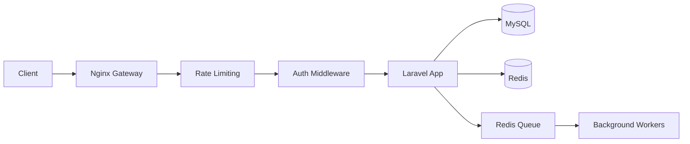
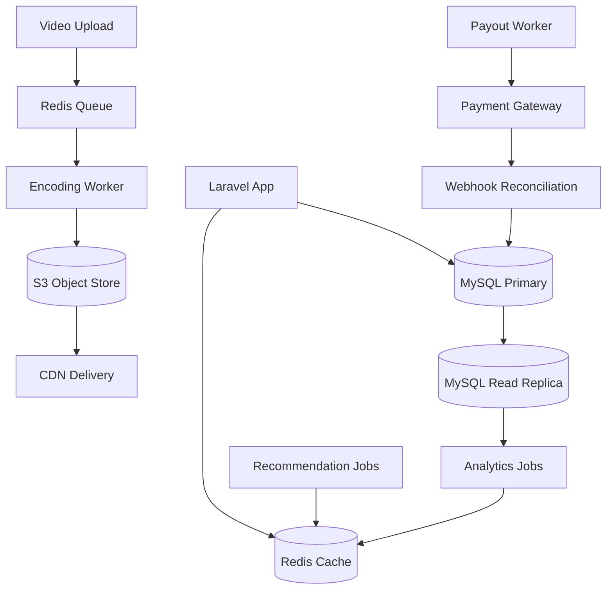

<div align="left">

# 🎬 Weekmotion

### System Architecture & Design Overview

*A scalable video-sharing, content monetization, and creator ecosystem*

---

[](#)
[](#)
[](#)
[](#)
[](#)
[](#)

</div>

---

## Overview

This repository is the architectural documentation and system design blueprint for **Weekmotion** — a scalable video-sharing, content monetization, and creator ecosystem built on a **decoupled monolithic architecture**.

The system is built for maintainability and efficient handling of media-heavy workloads, using asynchronous processing and strong database-level consistency as its two core design pillars.

---

## 📊 Platform Snapshot

| Attribute | Detail |
|---|---|
| **Founded** | 2021 |
| **Active Users** | 20,000+ |
| **Registered Users:** 65,000+ |
| **Creator Ecosystem** | ✅ |
| **Video Sharing Platform** | ✅ |
| **Community Feed System** | ✅ |
| **Digital Marketplace** | ✅ |
| **Professional Services Platform** | ✅ |
| **REST API** | ✅ v1 Stable |
| **Environment Strategy** | Dev · Staging · Production |
| **Uptime Target (SLO)** | 99.5% monthly |
| **Financial Consistency** | Immediate (synchronous ledger) |
| **Engagement Consistency** | Eventual (async queue) |

---

## 🗺️ System at a Glance

The simplest possible view of the platform — one request, start to finish:

```
Client → Nginx (Gateway + Rate Limit) → Laravel App (Auth + Logic)
                                              ↓              ↓           ↓
                                           MySQL          Redis       Redis Queue
                                                                          ↓
                                                                   Background Workers
                                                                   (encoding, payouts,
                                                                    notifications, reco)
```

> **Engagement signals** (likes, watches, follows) are written once by the Social & Engagement System and consumed across Feed ranking, Search personalization, and Recommendation scoring — no data is duplicated between systems.

---

## 🧠 Core Systems

Eight domain systems, each owning a clear slice of responsibility. Where systems share data (e.g. engagement signals feeding recommendations), the consuming system references the producing system rather than duplicating the concept.

---

### 1 · Media & Storage System

*Full lifecycle of video content — upload through encoding, delivery, and persistence.*

| Component | Description |
|---|---|
| **Chunked Video Ingestion** | High-volume uploads processed in sequential chunks, preventing web server blocking during large file transfers. |
| **Async Encoding Pipeline** | Raw video queued for format normalization and playback transcoding — fully decoupled from the HTTP cycle. |
| **Adaptive Streaming** | Processed video served as segmented files (HLS/MP4) stored by content ID, enabling range-request streaming without full-file delivery. |
| **CDN Asset Delivery** | Thumbnails, video segments, and digital assets served exclusively via CDN, removing origin load from high-traffic pages. |
| **Object Storage** | All binary media persisted to an S3-compatible object store — decoupled from the relational database and application filesystem. |
| **Relational Store (MySQL)** | All structured data — users, content metadata, transactions, social graph, notifications — persisted in MySQL with schemas indexed per query pattern. |
| **Cache Layer (Redis)** | Feed aggregates, engagement counters, session tokens, recommendation results, and watch-position state stored in Redis with TTL policies per data type. |
| **Role-Gated Content Middleware** | Real-time access control dynamically segregates content visibility between Free and Pro membership tiers. |

---

### 2 · Feed, Search & Discovery System

*Community feed, content filtering, full-text search, and recommendation — unified because all three consume the same engagement signals produced by the Social & Engagement System.*

| Component | Description |
|---|---|
| **Polymorphic Community Feed** | Articles, videos, and user updates powered by unified relational tables with polymorphic mapping for comments and reactions across all content types. |
| **Feed Filter System** | Frontend filter layer (All Content, Category, Course, Premium, Tools & Resources) operates as an orchestration layer over backend APIs without touching core feed logic. |
| **Full-Text Search** | Content records indexed via MySQL full-text indexes at current scale, schema designed for forward migration to a dedicated search engine as index volume grows. |
| **Search Ranking** | Results ranked by composite score: text relevance, recency, engagement signals (views + likes), and follow-graph proximity for authenticated users. |
| **Trending Keyword Boost** | Search query frequency aggregated over rolling time windows; queries exceeding a threshold boost associated content in discovery results. |
| **Recommendation System** | New users served trending and category-curated content (cold start). Once engagement history accumulates, a weighted interest profile (category affinity scores, updated via background jobs) drives personalized ranking across feed, related panels, and discovery surfaces. |
| **Trending Content Ranker** | Time-decayed engagement score computed per content item (recent views + likes + comments with exponential decay), surfacing genuinely trending over historically popular but stale content. |
| **Search & Recommendation Cache** | Frequently repeated queries and pre-computed recommendation sets stored in Redis — results served without per-request database overhead. |

---

### 3 · Monetization & Creator Economy System

*Creator eligibility, reward distribution, financial ledger, marketplace, and full payout lifecycle — one financial domain.*

| Component | Description |
|---|---|
| **Creator Eligibility Router** | Validates eligibility criteria (5 long videos and 50 subscribers) via indexed relational queries before monetization onboarding. |
| **Watch & Reward Pipeline** | Event-driven listeners capture consumption milestones and dispatch reward credits to background queues, away from the HTTP thread. |
| **Double-Entry Financial Ledger** | Deposits, withdrawals, and balances managed inside atomic `DB::transaction` blocks — consistency guaranteed, race conditions eliminated. |
| **Content Paywalls & Marketplace** | Single-unit purchase validation tokens securely unlock premium posts and digital assets. |
| **Revenue Sharing Model** | Creator earnings computed as a configurable platform-split at payout calculation time, not at transaction time — enabling rate changes without data migration. |
| **Creator Earnings Wallet** | Each creator maintains a ledger sub-account. Credits from rewards, sales, and subscription shares posted as atomic entries with full audit trail. |
| **Subscription Revenue Distribution** | On payment cycle settlement, a background job allocates the creator's share via a `DB::transaction`-wrapped double-entry post — no revenue created or lost. |
| **Withdrawal Processing** | Withdrawal requests enqueued as background jobs, validated against threshold and balance, then routed to the payment gateway — decoupled from HTTP to prevent timeout failures. |
| **Payment Gateway Integration** | Outbound payouts dispatched through a gateway abstraction interface. Gateway responses (success, pending, failed) reconciled back into the ledger via webhook listeners. |

---

### 4 · Social & Engagement System

*Follow relationships, likes, bookmarks, and watch history — unified because all produce the signals consumed by Feed & Discovery.*

| Component | Description |
|---|---|
| **Follow Relationship System** | Directed follow associations stored in an indexed relational graph table, supporting O(1) follow-state lookups and paginated follower/following retrieval. |
| **Subscriber Binding** | Paid subscription state bound to creator–user relationships, gating subscriber-only content and satisfying creator monetization threshold checks. |
| **Follow-Driven Feed Ranking** | Follow relationships propagate into feed ranking, surfacing content from followed creators at elevated priority. |
| **Social Metric Counters** | Follower and subscriber counts maintained as denormalized counters updated via background jobs, avoiding write contention during high-volume follow events. |
| **Like System** | Like events persisted via a polymorphic interactions table — unified handling across videos, posts, and articles without schema duplication. |
| **Bookmark System** | Bookmarks stored as user-scoped polymorphic records, accessible through a dedicated saved content panel. |
| **Engagement Signal Pipeline** | Like, bookmark, and watch events dispatched as background jobs — decoupled from the HTTP cycle, feeding the recommendation interest profile. |
| **Watch Event Recorder** | Video play events captured asynchronously as timestamped records powering watch history, continue watching, and the recommendation interest profile. |
| **Continue Watching State** | Last watched position per user per video updated on pause or exit, enabling seamless cross-device resume. |

---

### 5 · Notification System

*Event-driven dispatch, fully decoupled from application logic via the queue infrastructure.*

| Component | Description |
|---|---|
| **In-App Notification Dispatcher** | Platform events (new follower, comment, content unlock, reward credit) write notification records to a dedicated table, scoped per user with read-state tracking. |
| **Push Notification System** | Background worker reads from the push queue and batches device token dispatches to a third-party push provider — decoupled from the HTTP cycle. |
| **Creator Alert System** | Creators receive targeted alerts for subscriber milestones, new purchases, and eligibility changes via the same pipeline with creator-scoped filters. |
| **Notification Read-State** | Read/unread state tracked via indexed boolean flags with batch mark-as-read support to minimize update queries at scale. |

---

### 6 · Advertisement System

*Ad delivery, impression logging, and subscription-based bypass.*

| Component | Description |
|---|---|
| **Native Ad Campaign Engine** | Routes and serves Direct Link and Vignette ad zone streams based on client demand configuration. |
| **Async Impression Logging** | High-frequency impression events deflected to background queues, preventing write-locks on core tables under peak traffic. |
| **Subscription-Based Ad Bypass** | Middleware checks user subscription status and completely bypasses ad-injection loops for premium accounts. |

---

### 7 · Security System

*Practical security controls for a Laravel-based monolith at this scale — scoped to what is implemented.*

| Component | Description |
|---|---|
| **Rate Limiting** | Request rates enforced per-IP and per-user at Nginx and application middleware layers, with endpoint-class thresholds and temporary block on sustained violation. |
| **Spam Detection** | Repetitive submissions evaluated against frequency thresholds. Accounts exceeding signals are flagged for moderation review and rate-limited at the submission layer. |
| **Login Anomaly Detection** | Auth events logged with IP, device fingerprint, and timestamp. Logins from unrecognized devices trigger account notifications and may require re-authentication. |
| **Two-Factor Authentication (2FA)** | Creator and admin accounts support TOTP-based 2FA at session establishment. |
| **Session Management** | Sessions tracked per user with device identifiers. Users can revoke sessions from account settings; server-side invalidation enforced via Redis. |
| **Abuse Reporting System** | User-submitted reports enter the moderation queue with structured metadata. Repeat-reported content and repeat-offending accounts surfaced at elevated priority in the admin dashboard. |

---

### 8 · Platform Operations System

*API surface, observability, and admin tooling — the systems that keep the platform operable.*

| Component | Description |
|---|---|
| **REST API (v1)** | Resource-oriented REST API over core domain entities. Current stable surface is `v1`; `v2` reserved for future mobile and third-party integrations. |
| **API Gateway (Nginx)** | Nginx routes requests to Laravel with connection pooling and request buffering. Endpoint routing follows resource controller pattern with explicit HTTP verb mapping. |
| **Authentication System** | Laravel Sanctum: session-based auth for the web client, bearer token auth for API consumers, middleware-level validation on all authenticated endpoints. |
| **Request Validation** | Form Request validators enforce schema constraints and business rule pre-conditions before reaching service logic. |
| **Logging System** | Application events and errors written to structured log files with severity levels, organized by service context with configurable rotation. |
| **Error Tracking** | Exceptions captured and aggregated with grouped reports, stack traces, and affected user counts. Frequency alerts on high-volume errors. |
| **Queue Monitoring** | Queue depth, worker throughput, job failure rates, and retry counts monitored. Backlog alerts fire before issues reach user-facing latency. |
| **Slow Query Detection** | MySQL slow query logging captures threshold-exceeding queries for index optimization review, catching N+1 regressions before production. |
| **Uptime Monitoring** | Critical endpoints (feed, auth, upload, payment) monitored externally with alerting on availability degradation. |
| **Creator Studio** | Creators manage content, pricing, category assignments, and payout history from a unified interface. Analytics served from pre-aggregated background records, isolated from live write traffic. |

---

## 🆕 Extension Layer

> Built on top of the existing architecture without modifying core systems or database structure.

---

### 💬 Community Interaction System `NEW`

*Integrates with the existing polymorphic feed architecture.*

- Users can post comments on any content type
- Fully threaded reply system (comment → reply → nested reply)
- Real-time discussion structure for engagement
- Admin moderation support (delete comments & replies)

---

### 🏷️ Dynamic Category System `NEW`

*Extends the polymorphic content feed system without changing database core structure.*

- Admin can create, update, and manage content categories dynamically
- Each post can be assigned a category during creation
- Default category fallback when no category is selected
- Categories integrated into the feed filter layer

---

### 🔍 Smart Feed UI Layer `NEW`

*A frontend orchestration layer over existing backend feed APIs.*

- Global search bar for content discovery
- Filter system: All Content · Category · Course · Premium · Tools & Resources
- Unlocked Content quick-access panel for users

**Feed Portal:** [`weekmotion.com/feed`](https://weekmotion.com/feed)

---

### 🔓 User Unlock Library `ENHANCED`

*Integrates with the existing content paywall and marketplace system.*

- Users maintain a persistent Unlocked Content Library
- Subscription-based temporary access control remains unchanged
- Unlocked content restored automatically upon subscription renewal
- Library functions as a user-level access cache layer

---

### 📜 Content Governance System `NEW`

| Capability | Description |
|---|---|
| Copyright & Content Policy Center | Centralized policy reference for platform rules |
| Content Report Center | Community-driven content submission workflow |
| UGC Disclosure Notices | Transparency notices for user-generated content |
| Copyright Complaint Workflow | Structured review pipeline for copyright claims |
| Moderation Tools | Admin-level content management suite |
| Premium Preview Protection | Access-controlled preview layer for paid content |

**Compliance:** Users can report policy violations, copyright owners can submit infringement complaints, and reported content may be reviewed, restricted, or removed. Repeat violations may result in account restrictions.

---

### 🛠 Admin Control Panel `EXTENDED`

*Extends the existing role-based middleware system.*

- Category management dashboard
- Comment moderation: view all (latest first), threaded reply visualization, delete functionality
- Content visibility monitoring for feed system

---

## ⚙️ System Impact Summary

| Preserved System | Status |
|---|---|
| Media ingestion pipeline | ✅ Intact |
| Monetization and ledger system | ✅ Intact |
| Role-gated content middleware | ✅ Intact |
| Asynchronous processing architecture | ✅ Intact |

> No core database disruption — only layered feature expansion.

---

## 🌐 Digital Services Platform

Beyond the creator ecosystem, Weekmotion operates a dedicated services platform for businesses and entrepreneurs.

### Service Capabilities

| | |
|---|---|
| Custom Website Development | Domain & Hosting Services |
| E-Commerce Solutions | WhatsApp Marketing |
| SEO Optimization | Bulk SMS Solutions |
| Digital Advertising & Growth Services | |

- Conversion-focused landing page with mobile-first responsive design
- SEO-optimized content architecture for better discoverability
- Improved lead generation workflow and service presentation

**Service Portal:** [`weekmotion.com/service`](https://weekmotion.com/service)

> The service platform expands Weekmotion into a complete digital ecosystem — content, community, and professional services under one roof.

---

## 🏛️ Infrastructure & Deployment Architecture

*How the platform is physically structured, deployed, and operated across environments.*

---

### Infrastructure Architecture

The platform runs on a cloud-hosted Linux server environment using Nginx as the edge layer and PHP-FPM as the application process manager. All infrastructure components — web process, queue workers, MySQL, and Redis — are provisioned and configured as isolated services on a shared host, with the option for independent vertical or horizontal scaling per service.

| Layer | Technology | Role |
|---|---|---|
| **Edge / Reverse Proxy** | Nginx | SSL termination, request routing, rate limiting, static asset serving |
| **Application Process** | PHP-FPM + Laravel | HTTP request handling, business logic, API routing |
| **Queue Workers** | Laravel Horizon / Artisan Worker | Background job processing — encoding, payouts, notifications, analytics |
| **Relational Database** | MySQL 8.x | Primary structured data store |
| **Cache & Queue Broker** | Redis | Session store, cache layer, background job queue |
| **Object Storage** | S3-compatible | Binary media persistence — video, thumbnails, assets |
| **CDN** | CDN provider | Edge delivery of processed media assets globally |

---

### Environment Strategy

The platform operates across three isolated environments — each serving a distinct purpose in the development and release lifecycle.

| Environment | Purpose | Data |
|---|---|---|
| **Development** | Local developer environment. Feature development, unit testing, integration testing. | Seeded test data. No real user data. |
| **Staging** | Pre-production validation. Full system integration, QA, regression testing, release candidate verification. | Anonymized production snapshot or representative synthetic dataset. |
| **Production** | Live platform serving 200,000+ active users. Zero-downtime deployment target. | Real user data. All writes permanent. |

Environment-specific configuration (database credentials, API keys, queue connections, storage paths) is managed via `.env` files excluded from version control, with production secrets managed through environment variable injection at the infrastructure level.

---

### Deployment Architecture

Deployments follow a structured release process designed to minimize downtime and deployment risk.

| Step | Action |
|---|---|
| **1. Code Review** | All changes reviewed and approved via pull request before merge to the main branch. |
| **2. Staging Deployment** | Merged code deployed to the staging environment. Full integration and regression tests executed. |
| **3. Staging Validation** | QA sign-off on critical paths: auth, upload, feed, payment, notification. |
| **4. Production Release** | Approved staging build promoted to production. Deployment via zero-downtime release script (Artisan `down` / `up` window minimized). |
| **5. Post-Deploy Verification** | Automated uptime and endpoint health checks run immediately post-deploy. Error tracking monitored for deployment-related error spikes. |
| **6. Rollback Trigger** | If error rate or uptime checks degrade within 15 minutes of deployment, rollback to previous release is initiated. |

---

### CI/CD Pipeline

The CI/CD pipeline automates testing and deployment validation across all environment stages.

| Stage | Tooling | Trigger |
|---|---|---|
| **Lint & Static Analysis** | PHP CS Fixer, PHPStan | Every pull request |
| **Unit & Feature Tests** | PHPUnit / Pest | Every pull request |
| **Build Artifact** | Composer install, asset compile | Merge to main |
| **Staging Deploy** | Automated deploy script | Merge to main |
| **Integration Tests** | Automated test suite against staging | Post staging deploy |
| **Production Deploy** | Manual approval gate → automated deploy | QA sign-off |
| **Post-Deploy Health Check** | Endpoint monitoring ping, error rate check | Immediately post-deploy |

---

## 🔄 Background Worker Architecture

*How asynchronous work is structured, prioritized, and operated across worker processes.*

The platform's background processing is the primary mechanism for decoupling time-sensitive user-facing operations from slower, high-volume processing tasks. Workers run as persistent processes managed independently from the Nginx/PHP-FPM web process.

### Queue Priority Architecture

Jobs are organized into priority-tiered queues to ensure critical financial and delivery operations are never blocked by high-volume analytics or recommendation work.

| Priority | Queue Name | Job Types | Worker Allocation |
|---|---|---|---|
| **Critical** | `critical` | Payment payouts, withdrawal processing, ledger reconciliation | Dedicated workers, highest priority |
| **High** | `high` | In-app notifications, push dispatch, content unlock events | High-throughput workers |
| **Default** | `default` | Engagement signal recording, watch events, comment indexing | Standard workers |
| **Low** | `low` | Analytics aggregation, recommendation batch jobs, impression logging | Background workers, can lag without user impact |
| **Maintenance** | `maintenance` | Database cleanup jobs, storage lifecycle enforcement, audit log archival | Off-peak scheduled workers |

### Worker Process Design

| Concern | Design |
|---|---|
| **Process Isolation** | Queue workers run in separate OS processes from the web server. A worker crash does not affect HTTP request handling. |
| **Failure Handling** | Failed jobs are retried up to a configurable maximum attempt count with exponential backoff. After max retries, jobs are moved to the failed jobs table for manual review. |
| **Memory Management** | Workers restart automatically after processing a configurable number of jobs to prevent PHP memory leaks from accumulating across long-running processes. |
| **Supervision** | Worker processes are supervised by a process manager (Supervisor) ensuring automatic restart on crash without manual intervention. |
| **Horizon Dashboard** | Laravel Horizon provides a real-time web dashboard for queue throughput, failed jobs, worker status, and job runtime metrics. |

---

## 🗃️ Caching Strategy

*How the platform uses Redis to eliminate redundant database queries and serve high-frequency reads at sub-millisecond latency.*

The caching layer is not a single monolithic cache — it is a set of domain-specific caching policies, each calibrated to the volatility and consistency requirements of its data type.

| Cache Domain | Key Pattern | TTL | Invalidation Strategy |
|---|---|---|---|
| **Feed Aggregates** | `feed:{user_id}:{page}` | 2 minutes | TTL expiry + explicit flush on new content publish |
| **Engagement Counters** | `counter:{type}:{content_id}` | 5 minutes | Background refresh job on counter update |
| **Recommendation Sets** | `reco:{user_id}:{surface}` | 30 minutes | Batch job recomputes and overwrites on schedule |
| **Search Query Cache** | `search:{hash(query)}` | 10 minutes | TTL expiry; trending queries refreshed more frequently |
| **Session Tokens** | `session:{token}` | Session lifetime | Explicit deletion on logout or revocation |
| **Watch Position State** | `watch:{user_id}:{content_id}` | 7 days | Overwrite on every playback position update |
| **Creator Wallet Balance** | `wallet:{creator_id}` | Invalidated on write | Explicit cache bust on every ledger post |
| **Notification Counters** | `notif_count:{user_id}` | Invalidated on write | Explicit bust on notification create and batch read |

**Cache Eviction Policy:** Redis is configured with `allkeys-lru` eviction policy, ensuring that under memory pressure the least recently used keys are evicted first. Critical keys (wallet balances, session tokens) are given longer TTLs and higher priority namespaces.

---

## 🗄️ Database Scaling Strategy

*How MySQL is structured to remain performant as data volume and query load grow.*

### Current Approach

| Strategy | Implementation |
|---|---|
| **Index-First Schema Design** | All frequently queried columns (user IDs, content IDs, created_at, status flags) carry composite or single-column indexes designed at schema creation time. |
| **Async Write Offloading** | High-volume writes (engagement events, impression logs, watch records) are processed via background jobs, reducing direct MySQL write pressure from the HTTP cycle. |
| **Denormalized Counters** | Follower counts, like counts, and view counts are maintained as denormalized columns updated via background jobs rather than computed via COUNT queries at read time. |
| **Cache-Absorbed Reads** | The majority of high-frequency reads (feed pages, engagement counts, recommendation sets) are served from Redis, significantly reducing MySQL read queries per request. |
| **Soft Deletes** | All user-generated content uses soft deletes (`deleted_at`) rather than hard deletes to avoid lock escalation on high-traffic tables during bulk removal operations. |

### Planned Scaling Path

| Trigger | Action |
|---|---|
| Read query load exceeds primary capacity | Introduce MySQL Read Replica; route analytics and reporting queries to replica |
| Write throughput causes primary lock contention | Partition high-volume tables (watch events, interaction logs) by time range |
| Content index search quality degrades | Migrate full-text search to Elasticsearch; MySQL retains structured data ownership |
| Single-domain write volume becomes a bottleneck | Evaluate domain-specific database isolation (financial ledger first candidate) |

---

## 💾 Storage Lifecycle Policy

*How binary media assets are managed from ingestion through archival and deletion.*

All media in the platform follows a defined lifecycle from upload through delivery, with retention and deletion governed by platform rules and creator actions.

| Stage | Description | Storage Tier |
|---|---|---|
| **Raw Upload** | Unprocessed video file received from client. Stored temporarily during encoding job. | Object store — temporary prefix |
| **Encoding Processing** | Background worker reads raw file, encodes to HLS/MP4 variants, writes processed segments. | Object store — processing prefix |
| **Published Asset** | Encoding complete. Processed segments and thumbnails moved to published prefix. CDN cache populated. | Object store — published prefix + CDN |
| **Content Removal** | Creator or admin removes content. Asset marked for deletion, CDN cache invalidated, object store deletion queued. | Deletion queue |
| **Hard Delete** | Queued deletion job executes object store removal. Database record soft-deleted; audit log entry retained. | Removed from object store |
| **Account Deletion** | All media assets associated with a deleted account enter the hard delete queue following the account data retention window. | Governed by data retention policy |

**Backup of Structured Data:** MySQL database snapshots are taken on a daily automated schedule. Snapshots are retained for a rolling 30-day window. Snapshot integrity is periodically verified via restoration test.

---

## 📊 Analytics Architecture

*How platform data is collected, aggregated, and made available for creator and operational reporting without impacting the live write path.*

The analytics system is designed as a read-optimized layer separated from the transactional database. All analytics data is derived from events written asynchronously to the raw event store and aggregated by scheduled background jobs.

| Component | Description |
|---|---|
| **Raw Event Collection** | Interaction events (views, likes, watch duration, purchases, subscriptions) are written as timestamped event records by background jobs, separate from the transactional tables they reference. |
| **Time-Bucketed Aggregation** | Scheduled jobs aggregate raw event records into pre-computed time-bucket summaries (hourly, daily, weekly) per creator and per content item. These summaries power all analytics dashboard queries. |
| **Creator Analytics API** | Creator Studio queries the pre-aggregated summary tables directly — no JOIN against raw event tables, no impact on transactional write performance. |
| **Platform-Level Analytics** | Operational metrics (DAU, content volume, revenue totals, queue throughput) are derived from the same aggregation pipeline, with platform-scoped summaries maintained in a separate reporting schema. |
| **Read Replica Routing** | All analytics queries are candidates for routing to the MySQL Read Replica (Stage 1 engineering milestone) to fully isolate analytical read load from the transactional primary. |
| **Retention Window** | Raw event records are retained for a rolling 90-day window. Pre-aggregated summaries are retained indefinitely as the long-term analytics record. |

---

## 🔐 Audit Logging & Admin Activity Tracking

*How the platform maintains a tamper-evident record of all sensitive operations and administrative actions.*

### Audit Log System

All state-changing operations on sensitive resources are written to an append-only audit log. The audit log is write-only from the application perspective — records are never updated or deleted by application code.

| Logged Event Category | Examples |
|---|---|
| **Financial Operations** | Ledger posts, withdrawals, payout dispatch, gateway reconciliation events |
| **Content Moderation Actions** | Content removal, account restriction, report resolution, copyright action |
| **Account Lifecycle Events** | Account creation, email change, password reset, 2FA enable/disable |
| **Permission Changes** | Role assignment, admin privilege grant/revoke |
| **Authentication Events** | Login success, login failure, session creation, session revocation |
| **Creator Eligibility Changes** | Eligibility status granted, revoked, or manually overridden |

Each audit record contains: `event_type`, `actor_id`, `target_type`, `target_id`, `payload_snapshot`, `ip_address`, `user_agent`, `created_at`.

### Admin Activity Tracking

All actions taken by admin accounts within the Admin Control Panel are logged as a sub-class of the audit log with elevated retention priority.

| Tracked Admin Action | Retention |
|---|---|
| Content visibility changes | 12 months |
| User account restriction / suspension | 24 months |
| Payout manual overrides | 36 months (financial audit requirement) |
| Role and permission changes | 36 months |
| Category and configuration changes | 12 months |

> Admin audit records are immutable once written. Access to the audit log table is restricted to read-only for admin dashboard queries; no admin UI action can modify or delete audit records.

---

## 📋 Content Lifecycle Management

*How content moves through creation, publication, moderation, and removal — and how each state transition is governed.*

```
Draft → Published → [Reported] → Under Review → [Restricted | Restored | Removed]
                                                        ↓
                                                  Archived / Hard Deleted
```

| State | Description |
|---|---|
| **Draft** | Content saved but not submitted. Visible only to the creator. Not indexed in feed or search. |
| **Published** | Active, publicly visible content. Indexed in feed, search, and discovery surfaces. |
| **Reported** | One or more user reports received. Content remains visible while under review unless auto-restriction threshold is met. |
| **Under Review** | Admin or moderation workflow has opened a review. Content may be temporarily restricted pending outcome. |
| **Restricted** | Content hidden from all public surfaces pending resolution. Creator notified. |
| **Restored** | Review complete, content found compliant. Returned to Published state. |
| **Removed** | Policy violation confirmed. Content permanently hidden. Creator notified with reason. Audit log entry created. |
| **Hard Deleted** | Asset deletion queued. Object store removal executed. Database record soft-deleted; audit record retained permanently. |

**Auto-Restriction Rule:** Content that receives N reports within a T-hour window triggers automatic restriction and creates a priority moderation queue entry — preventing high-volume coordinated abuse before admin review.

---

## 🚨 Moderation Workflow

*How the platform processes content reports, resolves moderation cases, and escalates edge cases.*

### Report Intake

1. User submits a report via the Content Report Center with report type (spam, copyright, harmful content, other) and optional description.
2. Report is written to the moderation queue with structured metadata: `report_type`, `content_id`, `reporter_id`, `timestamp`.
3. If the reported content crosses the auto-restriction threshold, it is immediately restricted and the case priority is elevated.

### Review & Resolution

| Step | Action |
|---|---|
| **Queue Triage** | Moderation dashboard surfaces cases by priority: auto-restricted first, then repeat-offender content, then chronological. |
| **Admin Review** | Admin reviews content against platform policy. Decision: Restore / Remove / Escalate. |
| **Resolution Action** | System executes the decision: content state transitions, creator notification sent, audit log entry written. |
| **Creator Appeal** | Creator may submit an appeal via the Content Report Center. Appeals enter a secondary review queue. |
| **Escalation** | Edge cases (legal notices, government requests, complex copyright disputes) are flagged for escalation outside the standard moderation workflow. |

### Repeat Offender Handling

Creators or users whose content generates sustained policy violations are flagged in the moderation system. The repeat offender flag surfaces all subsequent reports from that account at elevated priority and enables account-level restriction if violations continue.

---

## 🛡️ Creator Trust & Safety System

*How the platform protects creators from abuse, ensures fair treatment, and maintains the integrity of the creator economy.*

| Component | Description |
|---|---|
| **Creator Eligibility Transparency** | Creators can view their current eligibility metrics (video count, subscriber count) in real time from Creator Studio. Eligibility state changes trigger immediate creator alerts. |
| **Earnings Audit Trail** | Every credit, debit, and payout event in a creator's wallet is visible in full detail from Creator Studio — including the source event, timestamp, and amount. No black-box earnings. |
| **Payout Dispute Workflow** | Creators can raise a payout dispute from Creator Studio. Disputed payouts are flagged in the admin panel and reviewed against the ledger audit trail. |
| **Content Takedown Notification** | Creators are notified immediately when their content is removed or restricted, including the policy reason. Appeal pathway is surfaced in the notification. |
| **False Report Protection** | The moderation system tracks report-to-violation ratio per reporting user. Accounts with a pattern of false or malicious reports are flagged and their future reports are deprioritized. |
| **Creator Account Recovery** | Account recovery workflow available for creators who lose access due to 2FA device loss or compromised credentials, with identity verification steps before re-access is granted. |

---

## 🔑 API Versioning Strategy

*How the platform manages API evolution without breaking existing integrations.*

The API uses URI-based versioning (`/api/v1/`, `/api/v2/`) as the versioning strategy. This approach makes the active version explicit in every request, eliminates ambiguity in routing, and allows multiple major versions to coexist during migration periods.

| Principle | Policy |
|---|---|
| **Current Stable Version** | `v1` — all current platform functionality. |
| **Breaking Changes** | Any change that removes a field, changes a field type, or alters response structure requires a new major version. Never applied to an existing version. |
| **Non-Breaking Changes** | Additive changes (new optional fields, new endpoints) may be applied to the current version without a version increment. |
| **Version Sunset Policy** | A deprecated version receives a minimum 6-month sunset window with deprecation notices in API responses before decommission. |
| **`v2` Scope** | Reserved for next-generation mobile client and potential third-party integrations. Will introduce resource expansion (direct messaging, creator profiles, PWA support). |
| **Versioning in Headers** | API responses include `X-API-Version` and `X-Deprecation-Notice` headers where applicable, enabling clients to detect and respond to deprecation programmatically. |

---

## 🔁 Feature Flag System

*How the platform controls the rollout of new features without requiring a code deployment.*

Feature flags enable controlled, gradual, and reversible feature activation — decoupling code deployment from feature release.

| Flag Type | Use Case | Example |
|---|---|---|
| **Kill Switch** | Instantly disable a feature in production without a rollback deployment. | Disable recommendation engine if a ranking bug is discovered post-deploy. |
| **Percentage Rollout** | Enable a feature for a configurable percentage of users, increasing gradually as stability is confirmed. | Roll out new feed filter UI to 5% → 25% → 100% of users over 3 days. |
| **User Segment Flag** | Enable a feature only for specific user groups (e.g. creators, beta users, internal staff). | Enable Creator Studio v2 for verified creators only before general release. |
| **Environment Flag** | Feature enabled in staging but not in production — used during parallel testing of new system behavior. | Run Elasticsearch search alongside MySQL search in staging for comparison. |

Feature flag state is stored in the application configuration layer, readable by the application at runtime without requiring a deployment. Flag changes are logged in the audit system.

---

## 📦 Release Management Process

*How changes move from development to production safely.*

| Phase | Description |
|---|---|
| **Development** | Feature branches developed against a local environment. Unit and feature tests written alongside code. |
| **Code Review** | Pull request opened. Peer review required. CI pipeline runs lint, static analysis, and test suite. Merge blocked until all checks pass. |
| **Staging Release** | Approved PRs merged to main and deployed automatically to staging. Integration and regression tests run. QA validation performed by the engineering team. |
| **Release Candidate** | Staging-validated build tagged as release candidate. Changelog and deployment notes prepared. |
| **Production Deployment** | Manual approval gate. Zero-downtime deploy executed. Post-deploy health check runs automatically. |
| **Feature Flag Activation** | New features remain behind flags post-deploy. Flags activated incrementally per the rollout plan. |
| **Monitoring Window** | 30-minute post-deploy monitoring window. Error tracking and queue health checked. Rollback initiated if degradation detected. |
| **Post-Deploy Review** | 24-hour post-deploy review of error rates, queue throughput, and user-facing performance metrics. |

---

## 📡 Monitoring & Observability Architecture

*How the platform maintains operational visibility across all system layers.*

Observability is structured across three signals — logs, metrics, and health checks — each covering a different dimension of system health.

### Logs

| Log Type | Capture | Retention |
|---|---|---|
| **Application Logs** | HTTP requests, controller actions, service events, warnings, errors | 30 days rolling |
| **Queue Worker Logs** | Job dispatch, job completion, job failures, retry attempts | 30 days rolling |
| **Slow Query Logs** | MySQL queries exceeding the configured execution threshold | 14 days rolling |
| **Nginx Access Logs** | All inbound requests with response codes, response times, and client IPs | 7 days rolling |
| **Audit Logs** | Financial operations, moderation actions, admin activity (see Audit Logging section) | Per audit retention policy |

### Metrics

| Metric | Alerting Threshold |
|---|---|
| HTTP error rate (5xx) | Alert if > 1% of requests over 5 minutes |
| API response time (p95) | Alert if > 2 seconds over 5 minutes |
| Queue backlog depth | Alert if critical queue exceeds 500 pending jobs |
| Job failure rate | Alert if > 5% of jobs failing in any 10-minute window |
| MySQL connection pool usage | Alert if > 80% pool utilization |
| Redis memory usage | Alert if > 75% of configured max memory |

### Health Checks

Critical platform endpoints are monitored via external uptime checks on a 60-second interval. Monitored endpoints: `/health`, `/api/v1/feed`, `/api/v1/auth/check`, `/api/v1/upload/status`, `/api/v1/payment/status`.

---

## 🚑 Incident Response Workflow

*How the platform detects, responds to, and recovers from production incidents.*

### Severity Classification

| Severity | Definition | Response Time |
|---|---|---|
| **SEV-1 (Critical)** | Platform down or data loss risk. Payment processing halted. Auth system failure. | Immediate — all hands |
| **SEV-2 (High)** | Core feature degraded (feed not loading, uploads failing, notifications not delivering). | Within 30 minutes |
| **SEV-3 (Medium)** | Non-core feature degraded. Performance regression. Elevated error rate without user impact. | Within 2 hours |
| **SEV-4 (Low)** | Minor UI bugs, non-critical system warnings, single-user reports. | Next business day |

### Response Steps

| Step | Action |
|---|---|
| **1. Detection** | Alert fires via monitoring system or user report is escalated. Incident is classified by severity. |
| **2. Acknowledge** | On-call engineer acknowledges the alert. Incident communication channel opened. |
| **3. Triage** | Root cause investigation begins. Logs, metrics, and queue health checked. Recent deployment identified as potential cause. |
| **4. Contain** | Immediate containment action: feature flag kill switch activated, rollback initiated, or traffic rerouted. |
| **5. Resolve** | Fix deployed or rollback confirmed. System health verified across all monitoring signals. |
| **6. Communicate** | User-facing status update published if applicable. Internal incident summary written. |
| **7. Post-Mortem** | Within 48 hours of SEV-1/SEV-2 resolution: root cause documented, timeline written, preventive actions identified and tracked. |

---

## 💰 Fraud Prevention Controls

*How the platform protects the financial integrity of the creator economy against abuse.*

| Control | Description |
|---|---|
| **Reward Event Deduplication** | Watch and consumption milestone events carry idempotency keys. Duplicate event submissions (network retries, replayed requests) are rejected at the queue processing layer — a single eligible event can credit a wallet exactly once. |
| **Eligibility Gate Enforcement** | Creator monetization eligibility checks are evaluated at every payout cycle initiation, not only at onboarding. Creators whose accounts fall below eligibility thresholds mid-cycle are paused from new reward accumulation. |
| **Withdrawal Threshold Enforcement** | Minimum withdrawal amounts and maximum single-withdrawal limits are enforced at the job validation layer before any gateway request is dispatched. |
| **Ledger Reconciliation Checks** | Scheduled reconciliation jobs verify that the sum of all ledger entries per creator matches the expected wallet balance. Discrepancies trigger an alert and freeze the affected wallet pending manual review. |
| **Gateway Webhook Verification** | All inbound payment gateway webhooks are verified via signature validation before any ledger action is taken. Unverified webhook calls are rejected and logged. |
| **Payout Velocity Limits** | Withdrawal requests exceeding a configurable frequency threshold within a rolling time window are flagged for manual review before processing. |
| **Suspicious Account Flagging** | Accounts exhibiting abnormal engagement patterns (view-farming signals, reward-gaming behavior) are flagged in the moderation system for review before next payout cycle. |

---

## 🔒 Security Incident Handling

*How the platform responds to security events beyond normal operational incidents.*

| Incident Type | Response |
|---|---|
| **Compromised Credential Report** | Affected account sessions immediately revoked via Redis session store. Password reset forced. Login anomaly audit reviewed. Account owner notified. |
| **Suspected Account Takeover** | Account locked pending identity re-verification. 2FA requirement enforced on re-access. Audit log reviewed for unauthorized actions during compromise window. |
| **API Key Exposure** | Exposed API key invalidated immediately. All sessions using the compromised key revoked. Replacement key issued. Incident logged in audit system. |
| **Elevated Abuse Pattern** | If rate limiting or spam detection identifies a coordinated abuse campaign, affected IP ranges or account clusters are temporarily blocked at the Nginx layer. Firewall rules updated. |
| **Data Integrity Alert** | If ledger reconciliation or audit log checks surface an anomaly, affected financial records are frozen. Manual review initiated. No payouts processed for affected accounts until resolution. |

---

## 📉 Business Continuity Planning

*How the platform sustains operations during infrastructure failures, provider outages, and data loss events.*

| Scenario | Impact | Recovery Strategy |
|---|---|---|
| **MySQL Primary Failure** | Platform read/write operations degraded. | Restore from latest automated snapshot. Target Recovery Time Objective (RTO): 2 hours. Target Recovery Point Objective (RPO): 24 hours (daily snapshot cadence). |
| **Redis Failure** | Cache and queue unavailable. Feed, session, and queue-dependent features affected. | Redis restarted from clean state. Cache rebuilt by background jobs on first access. Queue workers reconnect automatically on Redis recovery. Sessions require re-login. |
| **Object Storage Unavailability** | New video uploads fail. Existing CDN-cached assets continue to serve. Direct origin requests fail. | CDN cache provides continued delivery for recently accessed assets. New uploads queued and retried on storage recovery. |
| **CDN Provider Outage** | All media delivery (video, thumbnails) served via origin fallback. Performance degraded; origin load increases significantly. | Object storage origin serves as fallback. CDN provider redundancy is a Stage 2 planned capability. |
| **Payment Gateway Outage** | Withdrawal processing paused. Payout queue jobs accumulate in the queue. No ledger data loss. | Withdrawal jobs remain in queue. Processing resumes automatically on gateway recovery. Creators notified of processing delay. |
| **Full Platform Outage** | All services unavailable. | Maintenance page served by Nginx. Recovery from last known good state. Post-recovery system health check before traffic restoration. |

**Backup Schedule:**

| Asset | Frequency | Retention |
|---|---|---|
| MySQL Database Snapshot | Daily (automated) | 30 days rolling |
| Redis State | Not backed up — ephemeral by design | Rebuilt on restart |
| Object Storage | Provider-managed redundancy | Continuous (provider SLA) |
| Application Code | Git repository | Full history |

---

## 📏 Service Level Objectives (SLOs)

*The reliability targets the platform commits to maintaining, and the scaling triggers that govern infrastructure decisions.*

### Reliability Targets

| Metric | Target | Measurement Window |
|---|---|---|
| **Platform Uptime** | 99.5% monthly | Rolling 30 days |
| **API Response Time (p95)** | < 500ms | Per hour |
| **API Response Time (p99)** | < 2 seconds | Per hour |
| **Payment Processing Success Rate** | > 99.9% | Per day |
| **Video Upload Success Rate** | > 99.0% | Per day |
| **Queue Job Success Rate** | > 99.5% | Per day |
| **Push Notification Delivery** | > 98.0% | Per day |

### Error Budgets

Each SLO has a corresponding error budget — the allowed failure rate within the measurement window. When an error budget is consumed beyond 50%, new feature releases requiring that system are paused until the budget is restored. This prevents deploying new features onto an already-degraded system.

| SLO | Monthly Error Budget |
|---|---|
| Platform Uptime (99.5%) | 3.6 hours downtime per month |
| API p95 latency (< 500ms) | 2% of requests may exceed threshold |
| Payment Success (99.9%) | 0.1% of payment attempts may fail |

### Future Scaling Triggers

Infrastructure investments and architectural changes are triggered by measurable thresholds, not by calendar or speculation.

| Trigger Condition | Action |
|---|---|
| MySQL primary CPU > 70% sustained over 7 days | Introduce read replica; route analytics queries to replica |
| Queue backlog on critical queue > 1,000 jobs sustained | Add dedicated worker processes for critical queue |
| Redis memory usage > 80% sustained | Increase Redis memory allocation or introduce key eviction audit |
| Search relevance complaints exceed threshold | Begin Elasticsearch migration evaluation |
| p95 API response time > 500ms sustained over 7 days | Performance profiling sprint; query and cache optimization pass |
| Monthly active users exceed 500,000 | Architecture review: evaluate domain decomposition candidates |
| Single-domain write throughput becomes a bottleneck | Evaluate vertical scaling, table partitioning, or domain isolation |

---

## 📅 Data Retention Policy

*How long different categories of platform data are retained, and what governs their deletion.*

| Data Category | Retention Period | Deletion Trigger |
|---|---|---|
| **Active User Account Data** | Indefinite while account is active | Account deletion request |
| **Deleted Account Data** | 30 days post-deletion | Automated purge job at retention window expiry |
| **Financial Ledger Records** | 7 years | Regulatory requirement — never auto-deleted |
| **Audit Log Records** | Per category (see Audit Logging section) | Per category retention schedule |
| **Content (Published)** | Indefinite while active | Creator deletion or platform removal action |
| **Content (Removed by Moderation)** | Metadata retained 24 months; assets deleted immediately | Automated asset deletion on removal action |
| **Raw Event Records (Analytics)** | 90 days | Rolling automated purge |
| **Pre-Aggregated Analytics Summaries** | Indefinite | Not auto-deleted |
| **Application Logs** | 30 days | Log rotation policy |
| **Session Tokens** | Session lifetime + Redis TTL | Explicit revocation or TTL expiry |
| **Watch Position State** | 7 days inactivity | TTL expiry in Redis |

> Financial records are exempt from all standard retention purges. The double-entry ledger is the authoritative financial record and is retained in full for the platform's operational lifetime, subject to applicable regulatory requirements.

---

## ⚠️ System Constraints & Known Bottlenecks

Real systems have limits. These are the known constraints of the current architecture and how they are managed.

| Constraint | Risk | Mitigation |
|---|---|---|
| **Max Upload Size** | Very large files may exhaust worker memory or hit server timeout limits before chunking completes. | Chunked upload with configurable chunk size limits. File size validation enforced before ingestion begins. |
| **Queue Backlog Risk** | A spike in engagement events (viral content) can flood the queue faster than workers process it, delaying notifications and reward credits. | Queue depth monitoring with backlog alerts. Worker count scales horizontally. Non-critical job classes (analytics) separated from critical ones (payouts, notifications). |
| **MySQL Scaling Ceiling** | The relational database is the hardest constraint. At high write volume, a single MySQL primary becomes a bottleneck for concurrent engagement writes and media metadata. | Async writes via queue jobs reduce direct MySQL write pressure. Read replica routing planned for analytics. Cache layer absorbs the majority of read load. |
| **Redis Memory Pressure** | If feed aggregates, recommendation caches, and session data grow unbounded, Redis memory pressure leads to cache evictions that degrade performance. | TTL policies enforced per key type. Cache key namespacing isolates critical from non-critical data. Memory monitoring with alert thresholds. |
| **CDN Dependency Risk** | If the CDN provider has an outage, all media delivery (video, thumbnails, assets) is affected — the application itself stays up but content is inaccessible. | Object storage serves as the fallback origin. CDN provider redundancy is a Stage 2 engineering consideration. |
| **Monolith Scaling Ceiling** | The entire application scales horizontally as one unit. A single high-load system (e.g. encoding jobs) cannot be independently scaled without scaling the full application process. | High-load async work (encoding, payouts) runs in isolated worker processes, not the web process. This provides partial isolation without full service decomposition. |
| **Eventual Consistency Windows** | Engagement counts (likes, views) and recommendation scores are updated asynchronously — brief windows exist where displayed counts lag behind actual state. | Short TTL cache refresh cycles minimize the window. Database remains the authoritative source for financial data (immediate consistency always enforced). |

---

## ⚖️ System Tradeoffs & Design Decisions

Key architectural decisions, the reasoning behind them, and the tradeoffs consciously accepted.

---

### Monolith over Microservices

**Decision:** Decoupled monolith rather than microservices.

**Reasoning:** At 200,000+ users, a monolith removes significant operational overhead — no service mesh, no inter-service network latency, no distributed coordination, single deployment unit. Laravel's queue-based decoupling provides logical modularity without the infrastructure cost.

**Tradeoff:** Individual systems cannot be scaled independently. Horizontal scaling applies to the whole application process. This is the planned trigger for future decomposition if a single domain (e.g. encoding) becomes a sustained bottleneck.

---

### Async Queue over Synchronous Processing

**Decision:** High-frequency writes (engagement events, impression logs, notification dispatch, reward credits) handled via Redis-backed queues rather than inline HTTP.

**Reasoning:** Synchronous writes at volume block HTTP workers and inflate response latency unpredictably. Queue decoupling keeps API response times flat regardless of write spikes.

**Tradeoff:** Introduces eventual consistency for engagement data and requires retry logic and queue monitoring. Acceptable — financial operations remain synchronous and immediately consistent.

---

### Redis Caching Strategy

**Decision:** Engagement counters, feed aggregates, watch-state, and recommendation results served from Redis, not recomputed per-request from MySQL.

**Reasoning:** COUNT and JOIN-heavy aggregations on high-volume tables at request time would generate unsustainable MySQL read load as the platform grows.

**Tradeoff:** Cached values are eventually consistent. Cache invalidation errors can surface stale counts. Managed via short TTL policies and background refresh cycles; database is always the authoritative source.

---

### MySQL Full-Text Search over Elasticsearch

**Decision:** MySQL full-text indexes at current scale rather than a dedicated search engine.

**Reasoning:** Adequate relevance and performance at current content volume without the operational overhead of a separate Elasticsearch cluster. Schema is forward-migration-ready.

**Tradeoff:** Lower relevance quality (no BM25, no typo tolerance, limited faceting). Planned migration to Elasticsearch is triggered by index size or measurable relevance degradation — not by calendar.

---

### Double-Entry Ledger over Simple Balance Column

**Decision:** Immutable double-entry ledger records rather than a mutable balance field per user.

**Reasoning:** A mutable balance column is race-condition-prone under concurrent writes. The ledger with `DB::transaction`-wrapped atomic posts eliminates this class of bug entirely and provides a full, auditable history of every balance change.

**Tradeoff:** Balance reads require ledger entry aggregation rather than a single column read. Mitigated by caching computed balances, refreshed on every ledger write.

---

### Polymorphic Tables for Feed & Interactions

**Decision:** Comments, reactions, and feed events stored in polymorphic relational tables, not per-content-type tables.

**Reasoning:** Multiple content types (videos, articles, posts, assets) would require a schema change every time a new type is added under the per-table approach. Polymorphic handles all types with one schema and one query pattern.

**Tradeoff:** Polymorphic foreign keys cannot be enforced with native DB FK constraints — referential integrity shifts to the application layer. Requires disciplined soft-delete handling to prevent orphaned interaction records.

---

## 🏗️ Architecture Diagrams

---

### Diagram 1 · Request Flow

*How a client request travels from edge to response.*



---

### Diagram 2 · Data & Storage Flow

*How data moves between storage tiers — from write through processing to delivery.*



---

## 🚀 Roadmap

Organized into three delivery stages — reflecting realistic sequencing, not aspirational timelines.

---

### ✅ Recently Shipped / Live

The following social, creator experience, and commerce features have been successfully deployed to production and are now active:

| Feature | Type |
|---|---|
| Creator Profiles & Public Pages | Product |
| Cover Photos & Profile Verification Badges | Product |
| Like System | Product |
| Bookmark & Saved Content | Product |
| Personalized Activity Center | Product |
| Trending & Recommended Videos | Product |
| Direct Messaging System | Product |
| Creator Inbox | Product |
| Support Ticket Center | Product |
| Progressive Web App (PWA) | Product |
| Digital Downloads & License Key Distribution | Product |
| Premium Resource Marketplace | Product |

---

### Stage 1 · Next (Near-term)

Focusing on database scaling, system observability, and core performance enhancements.

| Feature | Type | Notes |
|---|---|---|
| Read Replica Query Routing | Engineering | Route analytics and reporting queries to replica |
| Performance Optimization Pass | Engineering | Query profiling, cache tuning, response time improvements |

---

### Stage 2 · Scale (Growth phase)

Infrastructure upgrades triggered by volume thresholds, not by calendar.

| Capability | Type | Trigger |
|---|---|---|
| Elasticsearch Migration | Engineering | Search index volume or relevance degradation |
| Mobile Push at Scale | Engineering | Push volume exceeds third-party tier limits |

---

### Stage 3 · Future Research

Capabilities that require significant new infrastructure or research — not near-term commitments.

| Capability | Notes |
|---|---|
| ML-Based Recommendation Model | Replaces rule-based baseline when training data volume justifies the investment |
| CDN Provider Redundancy | Multi-CDN failover for media delivery resilience |
| Microservice Decomposition | Triggered if a single domain (encoding, payments) becomes a sustained scaling bottleneck |

---

### 🎯 Vision

> The long-term vision of Weekmotion is to evolve from a content-sharing platform into a **complete creator, learning, commerce, and community ecosystem** capable of supporting creators, businesses, educators, and digital entrepreneurs at scale.

---

## 📋 Architecture Coverage Matrix

| System | Status | Layer |
|---|---|---|
| Media & Storage System | ✅ Implemented | Core |
| Feed, Search & Discovery System | ✅ Implemented | Core |
| Monetization & Creator Economy System | ✅ Implemented | Core |
| Social & Engagement System | ✅ Implemented | Core |
| Notification System | ✅ Implemented | Core |
| Advertisement System | ✅ Implemented | Core |
| Security System | ✅ Implemented | Core |
| Platform Operations System | ✅ Implemented | Core |
| Community Interaction System | ✅ Implemented | Extension |
| Dynamic Category System | ✅ Implemented | Extension |
| Smart Feed UI Layer | ✅ Implemented | Extension |
| User Unlock Library | ✅ Implemented | Extension |
| Content Governance System | ✅ Implemented | Extension |
| Admin Control Panel | ✅ Implemented | Extension |
| Digital Services Platform | ✅ Implemented | Business |
| Infrastructure & Deployment Architecture | ✅ Documented | Operations |
| Environment Strategy (Dev / Staging / Prod) | ✅ Documented | Operations |
| CI/CD Pipeline | ✅ Documented | Operations |
| Background Worker Architecture | ✅ Documented | Operations |
| Queue Priority Architecture | ✅ Documented | Operations |
| Caching Strategy | ✅ Documented | Operations |
| Database Scaling Strategy | ✅ Documented | Operations |
| Storage Lifecycle Policy | ✅ Documented | Operations |
| Analytics Architecture | ✅ Documented | Operations |
| Audit Logging & Admin Activity Tracking | ✅ Documented | Governance |
| Content Lifecycle Management | ✅ Documented | Governance |
| Moderation Workflow | ✅ Documented | Governance |
| Creator Trust & Safety System | ✅ Documented | Governance |
| API Versioning Strategy | ✅ Documented | Engineering |
| Feature Flag System | ✅ Documented | Engineering |
| Release Management Process | ✅ Documented | Engineering |
| Monitoring & Observability Architecture | ✅ Documented | Engineering |
| Incident Response Workflow | ✅ Documented | Engineering |
| Fraud Prevention Controls | ✅ Documented | Security |
| Security Incident Handling | ✅ Documented | Security |
| Business Continuity Planning | ✅ Documented | Reliability |
| Service Level Objectives (SLOs) | ✅ Documented | Reliability |
| Data Retention Policy | ✅ Documented | Compliance |
| Future Scaling Triggers | ✅ Documented | Reliability |
| Creator Profiles & Social Features | ✅ Implemented | Core |
| Direct Messaging & Inbox | ✅ Implemented | Core |
| Progressive Web App (PWA) | ✅ Implemented | Core |
| Digital Downloads & Marketplace | ✅ Implemented | Core |
| Read Replica Query Routing | 🟡 Stage 1 | Engineering |
| Performance Optimization Pass | 🟡 Stage 1 | Engineering |
| Elasticsearch Migration | 🔵 Stage 2 | Engineering |
| Mobile Push at Scale | 🔵 Stage 2 | Engineering |
| ML Recommendation | 🔵 Stage 3 | Future Research |
| CDN Provider Redundancy | 🔵 Stage 3 | Future Research |
| Microservice Decomposition | 🔵 Stage 3 | Future Research |

---

<div align="center">

*Weekmotion — Creator ecosystem built for scale.*

</div>
